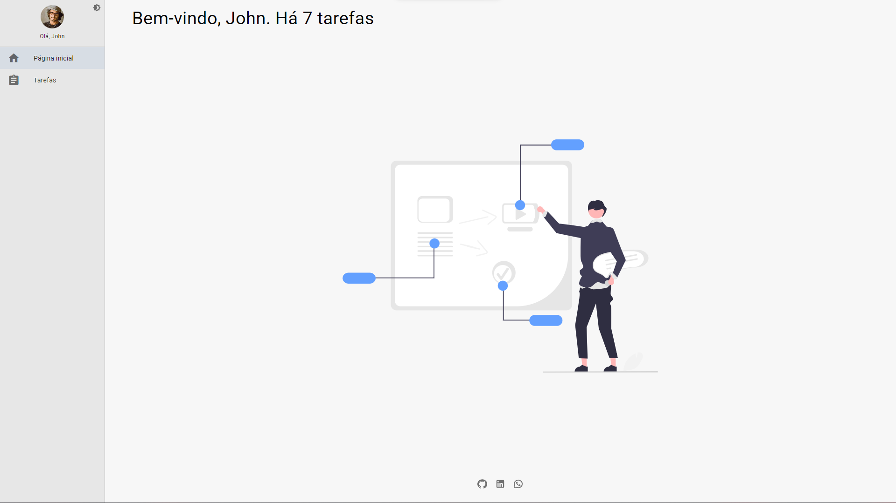
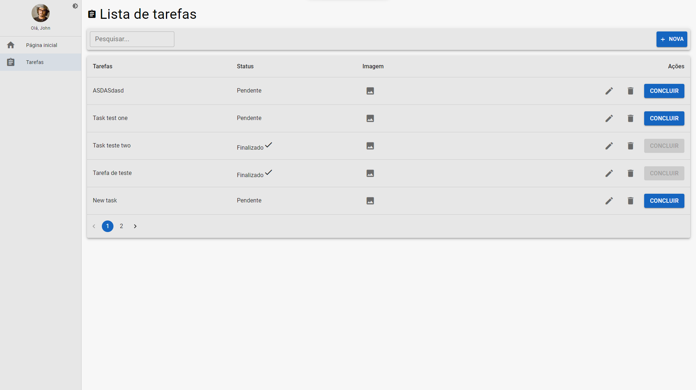
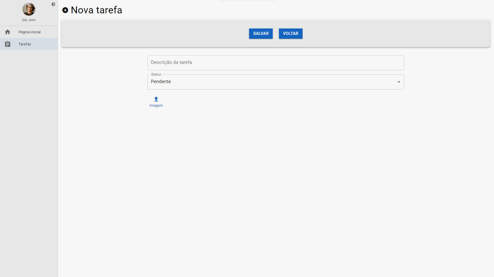

# Test BrickUp - Crud of tasks - Front-End

Application created for test of Junior developer, but i just developed the front-end, utilizing json-server in back-end

<a href='https://youtu.be/X-xxXEmYqz4' target='_blank'>Video of application</a>

1 - Home page with simple dashboard

  

2 - Listing page tasks with options for update and filter

  

3 - Page for include new task. (Equal the page of edit)

  

 

## 🚀 Go?

    For utilizing the app, access here: https://crud-tasks-project.netlify.app/

  

 

## 🎥 Usability and functionality

    Register tasks with simples clicks in screen. Enough informe yours infos and saved.

  

 

## 🛠️ Created with

    All techs he was created with:

-   [React](https://pt-br.reactjs.org/docs/getting-started.html)
-   [Material UI](https://mui.com/)
-   [Json-server](https://www.npmjs.com/package/json-server)
-   [Context API of React](https://pt-br.reactjs.org/docs/context.html#gatsby-focus-wrapper)
  

 

## 📌 Version

    All controlle of version it is here, on GitHub.

 

 

## ✒️ Autores

-   **Marcelo Silva** - _front-end of application_ - [/EuMarcel0](https://github.com/EuMarcel0)
  

 

## 📄 License

    Open Source.

 

 

## 🎁 Expression of gratitude

    I very happiness for conclusion this is project.

💻🚀😊😊
